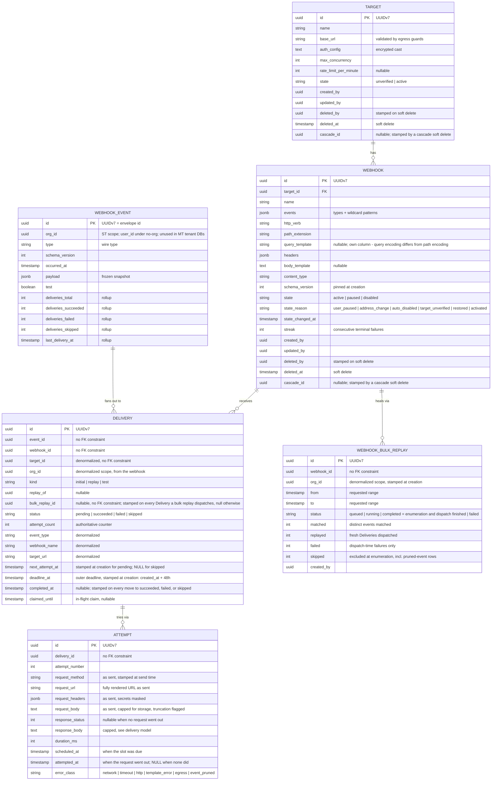

# Webhook Data Model — entities, the outbox, the recycle bin, retention

The deep reference behind the domain-model and persistence rules in
[[fleet-webhook-specification]]. Two kinds of rows live here and they age differently:
**configuration** (Targets, Webhooks — soft-deleted, recycle-binned, audited) and **history**
(events, Deliveries, Attempts — append-only, denormalized, pruned on a clock).

## The entities

The locked vocabulary, used everywhere including UI copy:

- **Target** — the receiving system: scheme + host + optional base path, plus its auth and
  signing configuration and secret(s) ([[webhook-signing-scheme]] owns the secret rules).
- **Webhook** — one subscription belonging to one Target: event selection (explicit wire types
  and/or wildcards), path extension, query string, HTTP verb, headers, body template, content
  type, state. The query string is stored in its own column (`query_template`, beside
  `path_extension`) because the two render locations carry different percent-encoding rules
  ([[webhook-templating]]'s render table).
- **Delivery** — the attempt-set for one event × one webhook: the unit that succeeds, fails,
  or is skipped.
- **Attempt** — a single HTTP try within a Delivery — precisely: one execution of the
  delivery pipeline past the claim (render, egress guard, HTTP). An Attempt that fails at an
  engine stage before the request leaves still writes its row, with `response_status` and
  `attempted_at` null and `error_class` naming the stage that failed
  ([[webhook-delivery-model]] owns the slot-consumption rules).

Backing them, the **outbox event row** (`webhook_events`): every emitted event is persisted,
whether or not anything subscribes to it. Cardinality: Target 1—\* Webhook; a Webhook subscribes
to many event types; one event fans out to every matching Webhook — **no fan-out cap**.
Delivery 1—\* Attempt. Quota ceilings on Targets and Webhooks are spec rules enforced at the
management surface ([[webhook-management-surface]]), never schema constraints.

Tables follow Laravel conventions: `webhook_targets`, `webhooks`, `webhook_events`,
`webhook_deliveries`, `webhook_attempts`, `webhook_bulk_replays`. The bulk-replay row backs the
progress endpoint — state and matched/replayed/failed/skipped counts, `created_by` for the
audit trail ([[webhook-management-surface]]); the counters are dispatch-scoped and `completed`
means enumeration and dispatch finished, never that the spawned Deliveries reached terminal
outcomes; `failed` means the enumeration itself exhausted its tries
([[webhook-delivery-model]] owns the semantics and the convergence rule). Every Delivery a
bulk replay dispatches is stamped with the row's id in its `bulk_replay_id` column — a plain
UUID like the other history columns, no FK constraint, null on every other Delivery — which is
the column the enumerating job's idempotence skip and the dispatch-scoped counters query
([[webhook-delivery-model]]). On the Delivery,
**`completed_at` is stamped by every path that moves the row to `succeeded`, `failed`, or
`skipped`** — the job's success and terminal paths, `DeliverWebhook::failed()`, the sweeper's
deadline-fail, and the point-of-work skip — so completion time is an explicit column, never
inferred from `updated_at` or from `max(attempts.attempted_at)` (the sweeper's deadline-fail
writes no Attempt row); the failing-days evaluator's window predicate reads it
([[webhook-delivery-model]]). On the Attempt, `scheduled_at` is when the
schedule slot was due and `attempted_at` when the request actually went out (null on an
Attempt that failed at the render or egress stage, before any request left) — the
scheduled-vs-actual pair the drill-down displays. `request_method` and `request_url` — the
fully rendered URL as sent — are stamped at send time exactly like
`request_headers`/`request_body`: verb, path extension, and query are all editable
mid-schedule and token-rendered per Attempt, so the drill-down's "request as sent" is
captured, never reconstructed from current configuration. `request_url` is display data,
subject to the capability-URL residual-risk ruling ([[webhook-threat-model]] I-6). The
migrations are the runnable truth and ship in
[`standards/laravel/webhooks/`](../../../standards/laravel/webhooks/) (bundle, future pass).

## Identity — UUIDv7 everywhere

All six tables use **UUIDv7 primary keys** generated app-side (`HasUuids`), exposed as JSON
strings per [[fleet-api-specification]] API-405. UUIDv7 is time-ordered, so the b-tree on the
high-write history tables stays append-friendly — the property that makes it acceptable as a
primary key where UUIDv4 is not. The `webhook_events.id` **is** the envelope `id`
([[webhook-event-catalog]]): one identity from emission through delivery, history, and receiver
dedupe, with no join table between "the event we stored" and "the event we sent".

## Outbox-lite — transactional mechanics

The invariant: **a business change and its event row commit or roll back together**, and no
delivery job exists for an uncommitted event. Four steps:

1. An Action mutates state inside a DB transaction and dispatches the domain event — fleet law:
   events dispatch from [[actions]], never from Models.
2. The engine's **single auto-wired subscriber** — registered at boot from the registry
   ([[webhook-event-catalog]]) for every `#[WebhookEvent]` class; apps write zero per-event
   listeners — runs **synchronously, in the same transaction**. It writes the `webhook_events`
   row (the frozen envelope snapshot, stamped with the emitting Action's org scope in ST apps)
   and resolves fan-out: one `webhook_deliveries` row per matching webhook **of the event's
   org** — `pending` for active webhooks, `skipped` for paused and disabled ones, so a gap is
   always recorded and later replayable ([[webhook-delivery-model]]). **Trashed Webhooks are
   excluded from fan-out entirely** — deletion means stop, bookkeeping included; no `skipped`
   rows accrue for them (consequence under Restore, below). Each Delivery stamps `org_id` from
   its webhook at creation (Attempts scope through their Delivery), and fan-out stamps
   `next_attempt_at` to the creation instant on every `pending` Delivery (skipped rows carry
   NULL) — so the sweeper's staleness predicate covers the commit-to-dispatch crash window by
   construction: a job lost before it ever dispatched goes stale on the same clock as any
   other orphan. The subscriber is
   deliberately synchronous because its whole job is to ride the business transaction; all slow
   work lives in the queued delivery jobs, per [[fleet-queue-doctrine]]'s jobs-are-envelopes law.
3. Delivery jobs dispatch **`afterCommit`**, one per pending Delivery, onto the `webhooks`
   queue ([[webhook-delivery-model]]). A rollback takes the event row and delivery rows with it
   and the jobs never dispatch: no ghost deliveries, no phantom events.
4. The **sweeper** closes the crash window — at any point in the schedule, not only before the
   first attempt: `php artisan webhooks:sweep`, scheduled every 5 minutes, re-dispatches a job
   for **any `pending` Delivery whose `next_attempt_at` (or claim expiry) is more than the
   grace period past** (default 10 minutes, tune-point `webhooks.sweeper.grace_minutes`) — a
   job lost after attempt 1 is an orphan exactly like a job lost before it. Deliveries past the
   outer deadline — the **`deadline_at` column**, stamped at creation as `created_at` + 48h,
   the same column the job checks before every requeue ([[webhook-delivery-model]]; the job's
   `retryUntil()` mirrors it — non-authoritative for the deadline value, though still required
   so the driver accepts the throttle path's unbounded genuine releases, per that page), so sweeper and job share one
   deadline no matter how many times a job is re-dispatched — are terminally failed instead
   of re-dispatched. **The claim is mechanical:** a `claimed_until` timestamp taken atomically
   (`UPDATE ... SET claimed_until = now() + interval WHERE claimed_until IS NULL OR
   claimed_until < now()`) when a job picks the row up, for the fixed claim interval
   [[webhook-delivery-model]] defines; the sweeper never touches a live claim.
   Re-dispatch is **at-most-once per grace window**: the sweeper's selecting `UPDATE` stamps
   the rows it re-dispatches in the same statement (`SET next_attempt_at = now() + grace`), so
   a row re-qualifies only after a further full grace period — queue lag past the grace never
   turns the sweeper into an amplifier re-dispatching the same backlogged rows every five
   minutes. Duplicate jobs are specified, not shrugged at, and the settlement is an
   **attempt-count fence**: every dispatch — initial, sweeper re-dispatch, or a schedule hop's
   fresh delayed dispatch — captures the
   Delivery's current `attempt_count` into the job payload, and the atomic claim `UPDATE`
   additionally requires `attempt_count = {captured}` — a zero-row match (claim held, Delivery
   no longer `pending`, or counter advanced) means another job consumed or is consuming that
   slot, and the stale twin exits silently without release. Counter-advancing schedule hops
   are fresh dispatches, never driver releases — a release re-queues the original payload,
   which structurally cannot re-capture the advanced counter ([[webhook-delivery-model]] owns
   the mechanics); a throttle release keeps the driver release, and because it never touches
   the counter, its unchanged captured value still matches healthy throttled work.
   A schedule hop's requeue clears the claim and stamps `next_attempt_at` = now() plus the
   hop's jittered delay — the hop computes that delay exactly once and the identical value is
   what the fresh dispatch's `->delay()` carries ([[webhook-delivery-model]] owns the
   computation) — so the staleness predicate measures true lateness, never jitter; a
   throttle release does the same with the schedule position unchanged, setting
   `next_attempt_at` to now()
   plus the fixed re-poll delay ([[webhook-delivery-model]] owns both numbers) — so healthy
   throttled work is never double-dispatched. The residual race — a worker and a
   sweeper-re-dispatched twin alive at once — is tolerated by at-least-once semantics and
   converges under the fence: a late twin dies at its first claim after any other job consumes
   a slot, because the counter it captured has advanced — so convergence holds beyond one
   grace window, not merely within it.

A partial unique index on `webhook_deliveries (event_id, webhook_id) WHERE kind = 'initial'`
guarantees fan-out never double-creates a Delivery; replays and tests are exempt by design
(`kind` = `replay` | `test`). Test-fire writes a synthetic `webhook_events` row flagged
`test = true` so test Deliveries reference a real event row like everything else; fan-out
ignores test events entirely, and test Deliveries are never enumerable by replay
([[webhook-delivery-model]]). The sweeper never **re-dispatches** a test Delivery — tests are
single-attempt by definition — but it **terminally fails** any `pending` test Delivery whose
claim or grace has lapsed, so a web process dying mid-test-fire converges to `failed` instead
of stranding a forever-pending row whose event row the pruning invariant could never release.

**Bare-URL verification pings have no row here by design.** A Delivery requires a `webhook_id`
and verification is Target-level — possibly before any Webhook exists — so the probe's outcome
is ephemeral: returned in the `/verify` response (the 409 detail on failure) plus one
structured stderr log line, never persisted. A verification satisfied through a `ping`
test-fire is stored as that test Delivery like any other ([[webhook-delivery-model]]).

## History denormalization

Delivery rows stamp `event_type`, `webhook_name`, `target_url`, `target_id`, and the owning
`org_id` **at creation** — the scope is denormalized exactly like the names, so ST history
queries filter on the column even after the config rows are purged, and the plain-UUID
`target_id` keeps the per-Target rollup's totals complete after a Webhook is purged (the
mutable, collidable `target_url` string is display data, never the join key). Attempt rows store the request **as sent**,
with every header value sourced from Target auth configuration — the `Authorization` bearer or
basic-auth value, the custom secret header — masked at write time (`***`; the real values never
reach the history tables). The stored `request_body` is display and audit data, capped at the
same **16KB** storage cap as the response capture ([[webhook-delivery-model]] owns the number)
with truncation flagged — replay re-renders from the frozen envelope, so nothing functional
ever reads the stored copy; the cap bounds history storage exactly as the response cap does,
while the wire itself stays uncapped (the payload-size non-rule is untouched). The HMAC
signature header is derived, not reversible, and stays
visible in full; the masked-value inventory is [[webhook-signing-scheme]]'s. Response capture
and its cap belong to [[webhook-delivery-model]].

The consequences are the point: renaming a webhook never rewrites history (rows show what was
true when they happened — an audit feature, not an anomaly), and purging config never orphans
it. History tables therefore carry **no foreign-key constraints** to the config tables — the
`webhook_id`/`target_id` columns are plain UUIDs for filtering while the referent lives, and the
denormalized columns keep the rows legible after it is purged.

## Soft delete, the recycle bin, cascade, and restore

`SoftDeletes` is **mandatory** on Targets and Webhooks — config is recoverable; history is never
soft-deleted, it ages out (retention, below). Every soft delete stamps `deleted_by` alongside
`deleted_at`; the bin surfaces both. Trashed rows form the **recycle bin**: list, restore,
purge (surface → [[webhook-management-surface]]).

**Cascade.** Soft-deleting a Target cascade-soft-deletes its live Webhooks in the same
operation, stamping the Target and every cascaded Webhook with a freshly minted **`cascade_id`**
(a nullable UUID column; individually trashed rows keep it null) — the cascade's explicit
provenance marker. `deleted_at` stays display and audit data only, never provenance: Laravel's
`softDeletes()` default is whole-second precision, so an individual delete and a cascade can
stamp equal timestamps within one second. The standing invariant: **a Webhook is never live
while its Target is trashed.**

**Restore is parent-first.** Three rules, in priority order:

1. Restoring a **Webhook** requires a live Target. If its Target is trashed, the restore is
   refused as a conflict — restore the Target first. The trashed-parent refusal is checked
   inside the restore transaction, under the same `lockForUpdate` on the Target row that
   serializes creation against a delete cascade ([[webhook-management-surface]] owns the
   serialization rule). No orphan revival, no implicit parent resurrection.
2. Restoring a **Target** restores the Target plus exactly the Webhooks carrying its
   `cascade_id` — never a `deleted_at` match. Webhooks trashed individually (null or different
   `cascade_id`) stay in the bin — the operator deleted those on purpose.
3. A restored **Webhook comes back `paused`**, never `active` — after days in the bin the
   receiver may have changed, so reactivation is an explicit human act. A restored Target
   returns to its prior verification state (state taxonomy →
   [[webhook-management-surface]]).

**The trash window is the one gap replay does not heal.** Fan-out excludes trashed Webhooks
entirely (outbox step 2), so no `skipped` rows exist for events that occurred while a Webhook
sat in the bin — restore-then-replay recovers pause and disable windows, never deletion
windows. Deletion means stop, bookkeeping included; the product statement lives in the W8/RB3
stories ([[webhook-product-requirements]]).

**Purge.** Hard delete happens two ways: an explicit purge from the bin, or the scheduled
pruner once a trashed row has sat in the bin past the window (below). Purge **cascades hard**:
purging a Target hard-deletes it and its (necessarily trashed) Webhooks. History rows are
untouched by purges — denormalization already paid for that. In-flight work self-resolves: a
delivery job that finds its Webhook **or its Target** trashed at the point of work terminates
the Delivery as `skipped` — soft deletion is orthogonal to the state columns, so a trashed
Target's state can still read `active` and the trash check is its own predicate; the same
point-of-work rule covers paused, disabled, and re-unverified states
([[webhook-delivery-model]]).

## Retention

Three windows, all **30 days**, all documented config tune-points (the documented-retention
precedent set by [[idempotency-keys]]):

| Data | Window | Tune-point |
|---|---|---|
| Deliveries + Attempts, incl. captured responses | 30 days | `webhooks.retention.history_days` |
| Outbox event rows (`webhook_events`) | 30 days | `webhooks.retention.events_days` |
| Recycle bin (trashed Targets/Webhooks) | 30 days | `webhooks.retention.recycle_bin_days` |

Pruning runs on the scheduler via Laravel's pruning machinery: `MassPrunable` on the history
models, `Prunable` with `forceDelete` on trashed config models. **The pruning invariant:**
`webhook_events` rows are never pruned while a **non-terminal** Delivery references them — so a
late-schedule retry can always render its envelope — and the check-and-delete is a **single
atomic statement**: one `DELETE` whose subquery excludes event rows referenced by any
non-terminal Delivery, evaluated in the same statement — which closes the pruner's **own**
check-then-act gap, and only that. Under READ COMMITTED a replay transaction can still read
the not-yet-deleted event row, insert its fresh `pending` Delivery, and commit while the
`DELETE` commits too; that race is absorbed by the `event_pruned` backstop and the 410 path —
which is precisely why the backstop is not dead code. The replay path MAY additionally take
`FOR KEY SHARE` on the `webhook_events` row in the transaction that inserts the Delivery, to
serialize against the pruner's `DELETE`. The runtime backstop holds
regardless: a delivery job that finds its event row absent terminates the Delivery as failed
with the dedicated error class `event_pruned` — never retried, never a Sentry event
([[webhook-delivery-model]] carries the taxonomy entry). The two windows are independent
tune-points, and `events_days` MUST be at least `history_days`. Under a conforming
configuration a Delivery within the history window always finds its event row; the 410
`webhook-event-pruned` and skipped-with-reason paths (single replay answers 410, bulk replay
counts the row as skipped-with-reason → [[webhook-management-surface]]) are the defensive
backstop for misconfigured windows and pruner races — rare because conforming retention
windows keep the pruner far from live work, not because the race is impossible. The
operational consequence to know: **bulk replay reaches back at most the outbox window**
([[webhook-delivery-model]]); after 30 days a failure is a report, not a recoverable.

## Tenancy scoping

> **MT/ST carve-out.** MT apps (stancl, subdomain-per-tenant): all tables live in the
> **tenant database**, and the `webhooks` queue workers are tenant-aware so delivery jobs run in
> tenant context; the `org_id` columns go unused there — the database boundary is the scope.
> Every scheduled webhook command — the sweeper, retention pruning, recycle-bin auto-purge, and
> the failing-days evaluator — runs **per tenant** via the tenancy runner (`tenants:run` /
> tenant-aware scheduling); a plainly wired scheduler entry would run once against the central
> context and silently touch no tenant database.
> ST apps: every config entity carries the owning org FK, history rows **denormalize the
> scope** — `org_id` on `webhook_events` (stamped from the emitting Action's org context), on
> `webhook_deliveries` (stamped from the webhook; Attempts scope through their Delivery), and
> on `webhook_bulk_replays` (stamped at creation like Deliveries, so the progress endpoint
> stays authorizable after its Webhook is purged) —
> and every query — management surface, fan-out, history — filters on it, which is what keeps
> fan-out org-correct (an org's `*` wildcard never matches another org's events) and history
> org-readable after its config is purged. **If the app has no org concept, scope to the
> user** (the columns carry the user id). Tenancy never appears in the payload: the envelope
> carries no tenant field ([[webhook-event-catalog]]), because isolation lives in scoping, not
> in data a receiver could read.

Config entities additionally carry `created_by`/`updated_by`; the audit-event requirements they
feed live in [[webhook-management-surface]].
